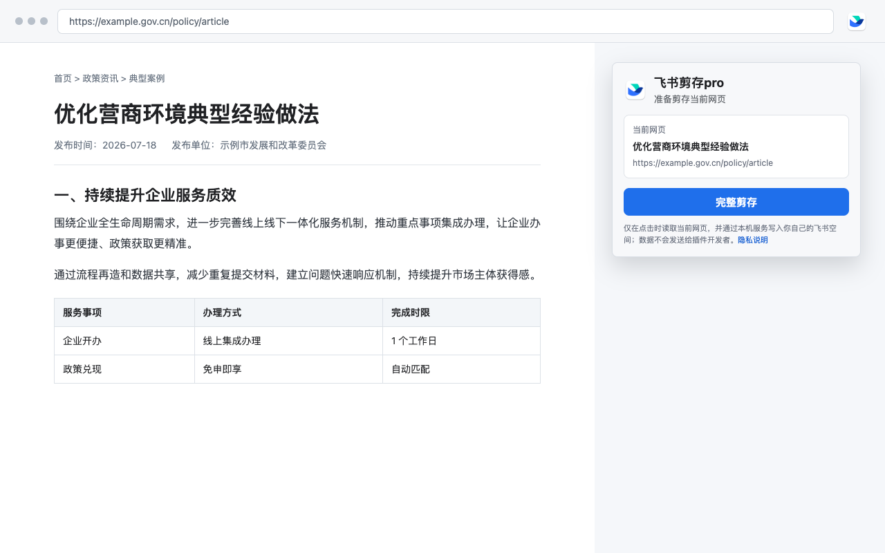
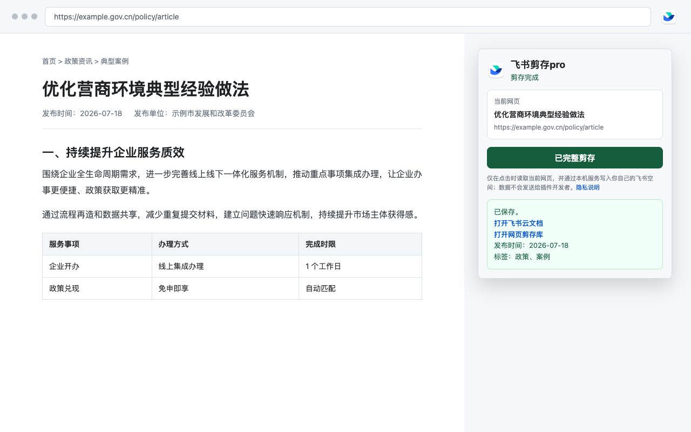

# 飞书剪存pro

将当前网页一键保存为排版后的飞书云文档，并同步建立可检索的飞书多维表格记录。


> 本项目是独立开源工具，并非飞书或 Lark 官方产品。飞书和 Lark 是其各自权利人的商标。

## 产品特色

- **完整正文**：识别文章真实标题、正文、图片、表格、列表、引用和标题层级。
- **通用清理**：过滤导航、页脚、分享按钮、编辑审核信息等网站要素。
- **双重归档**：同时创建云文档与多维表格记录，标题、日期、发布单位、标签和原链接保持一致。
- **统一目录**：自动在云盘根目录创建 `飞书剪存` 文件夹，并在其中管理文档和 `网页剪存库`。
- **删除联动**：云文档与对应记录任意一端被明确删除后，自动删除另一端。
- **隐私优先**：只在用户点击时读取当前网页；没有开发者中转服务器、广告或行为分析。

## 界面预览

准备剪存当前网页：



剪存完成后可直接打开飞书云文档和网页剪存库：



## 安装要求

浏览器扩展需要本机配套服务才能连接飞书。首次使用需准备：

- Chrome 或 Microsoft Edge
- Node.js 18 或更高版本
- 飞书或 Lark 账号
- 飞书官方 [`lark-cli`](https://github.com/larksuite/cli)

完整步骤见 [安装指南](INSTALL.md)。商店安装扩展后，仍需按安装指南完成一次本机服务和飞书授权配置。

- [GitHub Releases 下载](https://github.com/lproc2006/feishu-clipper-pro/releases)
- Chrome Web Store：提交审核后更新
- Microsoft Edge Add-ons：提交审核后更新

## 使用方法

1. 打开要保存的文章页面。
2. 点击浏览器工具栏中的“飞书剪存pro”。
3. 确认识别出的标题，点击“完整剪存”。
4. 从结果中打开飞书云文档或网页剪存库。

默认保存位置：

- `云盘根目录 / 飞书剪存 / <文章标题>`
- `云盘根目录 / 飞书剪存 / 网页剪存库`

多维表格字段依次为：标题、发布时间、发布单位、原网页链接、飞书文档链接、标签、正文。

## 隐私与安全

扩展只将用户主动选择保存的当前页面内容发送到 `127.0.0.1` 本机服务。本机服务再通过用户本人授权的 `lark-cli` 写入用户自己的飞书空间。认证信息由 `lark-cli` 管理，扩展及本项目均不保存飞书密码、应用密钥或访问令牌。

本机服务仅接受浏览器扩展来源的写入请求。详见 [隐私政策](PRIVACY.md) 与 [安全说明](SECURITY.md)。

问题反馈：[GitHub Issues](https://github.com/lproc2006/feishu-clipper-pro/issues)。

## 开发与测试

```bash
cd server
npm test
```

构建商店安装包：

```bash
bash scripts/build-release.sh
```

输出文件位于 `dist/`。

## 开源许可

项目采用 [MIT License](LICENSE)。正文识别使用 Mozilla Readability，许可文件见 `extension/vendor/READABILITY-LICENSE.md`。
